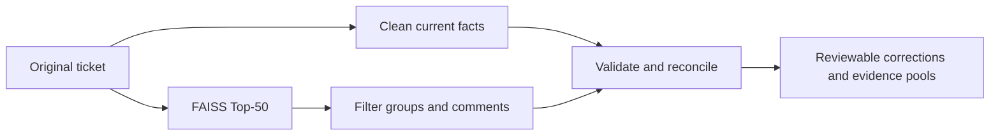

# Parallel clean + filter integration

This module checks ticket fields and filters FAISS candidates through two
concurrent branches. The lightweight default is **`gpt-5.5-2026-04-23`, reasoning
disabled (`none`)**, with one call per branch and no automatic retry. Each call
has a 1,500-token output ceiling; actual output is usually much shorter.
Set `ANALYSIS_REASONING_EFFORT=low` to opt into reasoning. The earlier 20-case
comparison favored low for quality; the lighter default prioritizes latency.

## Start and use

For a fresh checkout, first download the training snapshot and build the index
using [the root quick start](../README.md#run-locally). Generated artifacts are not
committed. From the repository root, with an existing retrieval artifact:

```sh
python -m pip install -e './backend[test]'
python backend/scripts/serve.py --artifact artifacts/retrieval/minilm-sdc-v1
```

The launcher uses `OPENAI_API_KEY` or asks for it without echo. It does not write
credentials to disk. Alternatively, supply the key through the server environment
and start `uvicorn service_desk.api:app`; `RETRIEVAL_ARTIFACT_DIR` must identify the
existing artifact. Keys are never sent to the frontend.

Start the frontend using its existing instructions. Upload tickets, open one,
and click **Clean & filter**. The page shows current/suggested fields, quoted
current evidence, clarification questions and independently selected historical
comments. Switch between primary candidates and the original Top-50. The download
button exports a correction preview and the analysis; it does not mutate the
imported ticket or write to Jira.

If no API key is configured, `/retrieval/search` remains available and
`/tickets/analyze` returns 503. `/health` reports `analysis_available`.

## One HTTP entry point

```sh
curl http://localhost:8000/tickets/analyze \
  -H 'Content-Type: application/json' \
  -d '{"summary":"Email outage for shared mailbox creation","description":"Please create a shared mailbox and distribution list. No mail outage occurred.","comments":[],"current_services":["Outlook & Email"],"current_work_type":"Incident"}'
```

The current structured service/type fields are used only to compare proposed
values against the input. Neither model receives those fields. The API accepts
the narrative directly so browser-local uploads need no server ticket record.

Response fields:

| Field | Contract |
|---|---|
| `status` | `ready`, `needs_review` for branch disagreement, or `partial` if a branch failed. Ready means validated output, not proven business correctness. |
| `clean.fields` | Service, work type and title suggestions with `current`, `suggested`, `state` and literal current evidence. |
| `clean.questions` | Missing facts that matter to interpretation. |
| `retrieval` | Original retrieval response: index/model version, cosine scores and all Top-50 hits. |
| `filter.candidates` | Original IDs, ranks, scores, descriptions and evidence with `primary`, `reserve` or `not_selected` roles. |
| `filter.primary_document_ids` | At most ten primary groups in original retrieval order. An empty list is valid. |
| `filter.comments` | Deduplicated exact comment patterns, applicability, conditions, current citations and original source relationships. |
| `filter.active_comment_ids` | Only `reference` or `conditional` comments; uncertain comments stay in reserve. |
| `conflicts` | Independent clean/filter service disagreements. |
| `cache_hit`, `elapsed_ms`, `compute_ms`, `timings` | Current Python request time, original compute time and branch measurements. |
| `stage_status` | Per-model-stage success/error type. Raw provider output is omitted from HTTP responses. |

`not_selected` means omitted from the active shortlist, not an explicit negative
relevance judgment. The faster format avoids generating 50 repetitive rejection
paragraphs. Unselected evidence remains inspectable. Cosine is never converted
into confidence, and `filter_rank` never replaces the original rank.

## Python entry point

```python
from service_desk.analysis import AnalysisConfig, TicketAnalysis, TicketInput
from service_desk.retrieval import TicketRetriever

retriever = TicketRetriever.load("artifacts/retrieval/minilm-sdc-v1")
pipeline = TicketAnalysis(retriever, api_key=api_key)
try:
    result = await pipeline.analyze(TicketInput(
        summary="Shared mailbox request",
        description="Create a shared mailbox and distribution list; no outage.",
        current_services=("Outlook & Email",),
        current_work_type="Incident",
    ))
finally:
    await pipeline.close()
```

Create one pipeline per server event loop and reuse it. Do not load an encoder or
construct a new provider client per request. `AnalysisConfig` also supports model,
reasoning effort, concurrent-call limit, stage deadline and cache bounds. Server
environment overrides are `ANALYSIS_MODEL` and `ANALYSIS_REASONING_EFFORT`.

## Scheduling and module boundaries



- `analysis/evidence.py` constructs lossless template compression and exact
  current fact spans, and keeps provider aliases separate from document IDs.
- `analysis/prompts.py` owns English instructions. No per-case decisions or
  evaluation labels appear in serving code.
- `analysis/contracts.py` owns structured schemas, citation/service/stage checks
  and deterministic response construction.
- `analysis/pipeline.py` owns async scheduling, client reuse, bounded admission,
  deadlines and cache lifecycle.
- `retrieval/retriever.py` supplies exact text and source services through
  `describe()` and `service_catalog()`. Index format and ranking are unchanged.

Clean runs from original facts and the service catalog. The other branch searches
the same original narrative, then filters its candidates. Clean output never
gates retrieval. A comment can survive an unsuitable parent title, and an accepted
parent does not make all its comments relevant.

The current corpus marks specific historical resolution narratives with the
`Resolution:` prefix. Those comments enter the semantic filter; generic status
comments remain in the original retrieval output. Extending this extraction rule
to other corpora requires evaluation, not a hardcoded lookup of these examples.

## Validation, uncertainty and failures

Q IDs point to exact current-ticket spans. Model-visible G aliases map back to
the server's original document IDs; E IDs hash exact historical comment text.
Validation checks schema, ID membership, uniqueness, cited current facts and
source-service compatibility. Historical authors are preserved in provenance
but withheld from model selection.

Active comments must match a supported current stage (`request`,
`external_delivery`, or `internal_processing`). Unknown stages and incompatible
stage hypotheses can only be reserved or omitted. A conditional remedy needs a
concrete prerequisite check. Stage classification is itself model-generated, so
these checks do not prove semantic correctness.

Every comment is marked `requires_current_verification=true` and
`execution_authorized=false`. No owner assignment, financial adjustment, system
restart or completed resolution is inferred or executed. Routing remains a
separate downstream consumer.

If clean and filter disagree on service, the service field becomes
`needs_review`; active evidence is moved to reserve, with proposed IDs retained
for audit. An unavailable filter preserves original retrieval in an
`unfiltered_fallback`. A failed clean leaves fields unchanged and still returns
successful filtering. The imported ticket is never modified by the endpoint.

The default allows six model calls concurrently per process. Each model stage
has a 45-second deadline including admission wait. Validation failures immediately
return partial results; there are no validation or SDK transport retries.
Successful results use a 64-entry, five-minute
memory cache keyed by all ticket inputs, model/config, prompts and index version.
Identical in-flight requests share work. Cancelling one waiter does not cancel a
shared result; shutdown cancels remaining tasks and closes the client. Partial
and conflicting results are not cached.

## Earlier measurements and their limits

The current lightweight implementation (`2dde5ef`) was smoke-tested on the first
three development tickets, one ticket at a time with both branches parallel:

| Measurement | Recorded value |
|---|---|
| Complete pipeline times | 4.86s, 4.08s, 3.85s |
| Median | 4.08s |
| Validated completions | 3/3; six model calls, no retries |
| Reasoning tokens | 0 |
| Average visible output per ticket, both calls combined | 273 tokens |
| Repeated-request cache probe | 42.8ms |

All three retained the original 50 IDs and ranks. These are Python pipeline
measurements excluding startup/model loading, HTTP and browser rendering.
Completion status is not accuracy. See the aggregate-only record with source
hashes in [lite-latency.json](../backend/validation/lite-latency.json).

See [PARALLEL_ANALYSIS_BENCHMARK.md](PARALLEL_ANALYSIS_BENCHMARK.md). The earlier
low-reasoning profile completed 20/20 development cases, with median 6.06s and maximum 12.17s
for retrieval plus both model branches. A repeated-request cache probe was 35ms
at Python level. Earlier single-stage verbose filtering had median 38.91s, but
that is a different model/prompt/output format, not a concurrency-only ablation.

That profile proposed four corrections on three tickets. It retained
a prior-review primary analogue in 18/18 judgeable cases and retained 19 historical
comment references actively plus two ambiguous cash-cutoff references in reserve.
These are comparisons with earlier assistant review, not official GT accuracy.

Across both branches, that run averaged 232 reasoning tokens and 329 visible
output tokens per ticket. The earlier V1 `none` run averaged zero reasoning
tokens and 312 visible output tokens, with median 3.77s; it also had two service
disagreements. V1 used different prompts. The new one-call-per-branch default
has passed local regression tests but has not been rerun on all 20 live examples;
neither earlier timing nor quality result should be presented as its measurement.

For a quick latency check of the current default, use the command below with
`--models gpt-5.5-2026-04-23 --limit 3 --concurrency 1`. Use a fresh output
directory so saved results cannot be mistaken for new calls.

Reproduce calls on your own local challenge file:

```sh
OMP_NUM_THREADS=4 MKL_NUM_THREADS=4 python backend/scripts/benchmark_analysis.py \
  --tickets /path/to/challenge.json \
  --artifact artifacts/retrieval/minilm-sdc-v1 \
  --output artifacts/analysis/new-run \
  --models gpt-5.4-2026-03-05 gpt-5.5-2026-04-23 \
  --reasoning-effort none
```

The runner accepts a raw ticket array or `{"records": [...]}`, prompts for the
key if needed, saves frozen input/code hashes, runs bounded concurrent tickets,
and records actual response usage and timings. It reads no evaluation labels.
Use a fresh output directory when changing code/prompts or model parameters.

## Taking over and adding downstream consumers

Use this module as the implementation, rather than recreating it from the
historical benchmark report. Start with `api.py`, `analysis/pipeline.py`, and
`analysis/contracts.py`; the module map above explains the remaining files.
The application has no dependency on a research checkout or its evaluation labels.

Resolution generation and routing were discussed but are not implemented here.
A future consumer can select the supported evidence from an analysis response:

```python
filtered = result.get("filter")
if filtered and filtered["status"] == "ready":
    primary_ids = set(filtered["primary_document_ids"])
    active_ids = set(filtered["active_comment_ids"])
    primary_groups = [g for g in filtered["candidates"] if g["document_id"] in primary_ids]
    active_comments = [c for c in filtered["comments"] if c["id"] in active_ids]
else:
    primary_groups, active_comments = [], []
```

Pass original current facts and these selections to a future consumer. Keep the
comment conditions, evidence IDs and source relationships. A selected parent
does not activate its other comments. Do not treat reserve/not-selected evidence
as a supported fix, or an unfiltered fallback as a successful filter. Clean field
suggestions are reviewable proposals, not verified updates to the current ticket.
Historical remedies do not establish the current cause or completed resolution.
The existing feedback endpoint records human review; adding a resolve stage must
not silently mark the ticket resolved or change the retrieval/index contract.

## Checks

```sh
python -m pytest backend/tests -q
cd frontend
npm run typecheck
npm run lint
npm run build
npm run test:e2e
```

Tests cover concurrent branch start, literal provenance, rejected-parent comment
survival, in-flight deduplication, cache invalidation, deadlines/partial outputs,
disagreement holds, stale frontend responses and copy-only preview export.
The integration passed 23 backend tests, six browser tests, type checking, lint
and the production frontend build. A real `/tickets/analyze` call using the earlier
low-reasoning default returned HTTP 200, corrected the mailbox-request title, and preserved all
50 candidates, with the selected analogue retaining original rank 9.

Official provider references: [GPT-5.5 model](https://developers.openai.com/api/docs/models/gpt-5.5)
and [Structured Outputs](https://developers.openai.com/api/docs/guides/structured-outputs).
